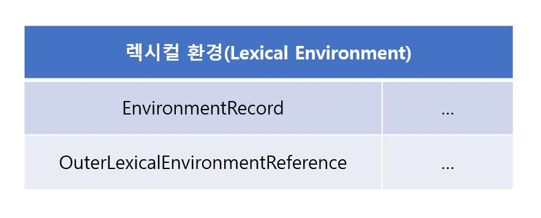

# 실행 컨텍스트

## 소스코드의 타입

ECMAScript 사양은 4가지 타입으로 구분된다.
4가자 타입의 소스코드는 실행 컨텍스트를 생성한다

- 전역 코드

  - 전역에 존재하는 소스코드를 말한다
  - 전역에 정의된 함수, 클래스 등의 내부 코드는 포함하지 않는다

- 함수 코드

  - 함수 내부에 존재하는 소스코드를 말한다
  - 함수 내부에 중첩된 함수, 클래스 등의 내부 코드는 포함되지 않는다

- eval 코드(사용이 권장되지 않는다)

  - 빌트인 전역 함수인 eval 함수에 인수로 전달되어 실행되는 코드를 말한다

- 모듈 코드
  - 모듈 내부에 존재하는 소스코드를 말한다
  - 모듈 내부의 함수, 클래스, 등의 내부 코드는 포함되지 않는다

## 소스코드의 평가와 실행

자바스크립트 엔진은 소스코드 평가와 소스코드 실행 과정으로 나누어 처리한다

소스코드 평가과정

1. 실행 컨텍스트 생성
2. 변수, 함수 등의 선언문만 먼저 실행
3. 생성된 변수나 함수 식별자를 키로 실행 컨텍스트가 관리하는 스코프(렉시컬 환경의 환경 레

소스코드 평가 과정이 종료되면 소스코드가 실행되는 런타임이 실행된다

1. 선언문을 제외한 소스코드가 순차적으로 실행된다
2. 소스코드 실행에 필요한 정보인 변수나 함수의 참조를 실행 컨텍스트가 관리하는 스코프에서 검색한다

- 변수 값의 변경등 소스코드의 실행 결과는 다시 실행 컨텍스트가 관리하는 소크프에 등록한다

## 실행 컨텍스트의 역할

1. 전역 코드 평가

- 전역에 존재하는 변수와 함수 선언문을 먼저 실행하여 실행 컨텍스트의 전역 스코프에 등로된다
- var 키워드로 선언한 변수와 함수 선언문의 경우 전역 객체의 프로퍼티가 된다
- let, const 키워드로 선언한 변수는 보이지 않는 개념적 블록에 존재한다

2. 전역 코드 실행

- 런타임이 시작된다. 전역 변수에 값이 할당되고 함수가 호출된다
- 함수가 호출되면 전역 코드 실행이 임시 중단되고 함수 내부로 진입하여 코드를 실행한다

3. 함수 코드 평가

- 함수의 매개변수와 지역 변수 선언문을 먼저 실행하고 실행 컨텍스트의 지역 스코프에 등록된다
- 함수 내부에서 지역 변수처럼 사용가능한 arguments 객체가 생성되어 지역 스코프에 등록되고 this바인딩도 결정된다

4. 함수 코드 실행

- 런타임이므로 매개변수와 지역 변수에 값이 할당된다
- 함수 호출 코드가 존재한다면 함수를 호출한 식별자를 스코프 체인을 통해 검색한다
- 전역 스코프까지 탐색하나 전역 스코프에 해당 함수가 존재하지 않는다면 전역 객체 프로퍼티를 전역 스코프처럼 검색한다
- 호출한 함수 메서드를 식별자 객체의 프로토타입 체인을 통해 검색한다
- 인수가 존재한다면 인수를 전달한 표현식을 평가하고 각 식별자를 스코프 체인을 통해 검색한다
- 함수 실행이 종료되면 함수 호출 이전으로 돌아가 전역 코드 실행을 계속한다

이처럼 코드가 실행되려면 스코프를 구분해 식별자와 바인딩된 값이 관리되어야 하며
중첩 관계에 의해 스코프 체인을 형성하고 식별자를 검색할 수 있어야 한다
또한 전역 객체의 프로퍼티도 전역 변수처럼 검색할 수 있어야 한다

함수 호출이 종료되면 함수 호출 이전으로 돌아가므로 현재 실행 중인 코드와 이전에 실행하던 코드를
구분해서 관리해야 한다

- 선언에 의해 생성된 모든 식별자(변수, 함수, 클래스 등)를 스코프를 구분하여 등록하고 상태 변화(식별자에 바인딩된 값의 변화)를 지속적으로 관리할 수 있어야 한다
- 스코프는 중첩 관계에 의해 스코프 체인을 형성해야 하며 스코프 체인을 통해 상위 스코프로 이동하여
  식별자를 검색할 수 있어야 한다
- 현재 실행 중인 코드의 실행 순서를 변경(함수 호출에 의한 실행 순서 변경 등) 할 수 있어야 하며
  다시 되돌아갈 수 있어야 한다

이 모든 것을 관리하는 것이 실행 컨텍스트이다
**실행 컨텍스트는 소스코드를 실행하는데 필요한 환경을 제공하고 코드 실행 결과를 실제로 관리하는 영역이다**
**실행 컨텍스트는 식별자(변수, 함수, 클래스 등)를 등록하고 관리하는 스코프와 코드 실행 순서 관리를 구현한 내부 메커니즘으로 모든 코드는 실행 컨텍스트를 통해 실행되고 관리된다**

식별자와 스코프는 실행 컨텍스트의 **렉시컬 환경**이 관리하고
코드 실행 순서는 **실행 컨텍스트 스택**으로 관리한다

## 실행 컨텍스트 스택

자바스크립트 엔진은 실행 컨텍스트를 스택(Stack) 자료 구조로 관리하며
이를 실행 컨텍스트 스택이라 부른다

```js
const x = 1;

function foo() {
  const y = 2;

  function bar() {
    const z = 3;
    console.log(x + y + z);
  }
  bar();
}

foo(); // 6
```


1. 전역 코드의 평가와 실행

자바스크립트를 먼저 전역 코드를 평가하여 전역 실행 컨텍스트를 생성하고 실행 컨텍스트 스택에 푸시한다
이때 전역 변수 x와 전역 함수 foo는 전역 실행 컨텍스트에 등록된다
이후 전역 코드가 실행되기 시작하여 전역 변수 x에 값이 할당되고 전역 함수 foo가 호출된다

2. foo 함수 코드의 평가와 실행

전역 함수 foo가 호출되면 전역 코드의 실행은 일시 중단되고 코드의 제어권이 foo 함수 내부로 이동한다
자바스크립트 엔진은 foo 함수 내부의 함수 코드를 평가하여 foo 함수 실행 컨텍스트를 생성하고
실행 컨텍스트 스택에 푸시한다
이때 foo 함수의 지역 변수 y와 중첩 함수 bar가 foo 함수 실행 컨텍스트에 등록된다
이후 foo 함수 코드가 실행되기 시작하여 지역 변수 y에 할당되고 중첩 함수 bar가 호출된다

3. bar 함수 코드의 평가와 실행

중첩 함수 bar가 호출되면 foo 함수 코드의 실행이 일시 중단되고 코드의 제어권이 bar 함수 내부로 이동한다
자바스크립트 엔진은 bar 함수 내부의 함수 코드를 평가하여 bar 함수 실행 컨텍스트를 생성하고 실행 컨텍스트 스택에 푸시한다
이때 bar 함수의 지역 변수 z가 bar 함수 실행 컨텍스트에 등록된다
이후 bar 함수 코드가 실행되기 시작하여 지역 변수 z에 값이 할당되고 console.log 메서드를 호출한 후
bar 함수는 종료(스택에서 제거된다)된다

4. foo 함수로 복귀

bar 함수가 종료되면 코드의 제어권은 다시 foo 함수로 이동한다
이때 자바스크립트 엔진은 bar 함수 실행 컨텍스트를 실행 컨텍스트 스택에서 pop하여 제거한다
그리고 foo함수는 더 이상 실행할 코드가 없으므로 종료된다

5. 전역 코드로 복귀

foo 함수가 종료되면 코드의 제어권은 다시 전역코드로 이동한다
이때 자바스크립트 엔진은 foo 함수 실행 컨텍스트를 실행 컨텍스트 스택에서 pop하여 제거한다
그리고 더 이상 실행할 전역 코드가 남아 있지 않으므로 전역 실행 컨텍스트도 실행 컨텍스트 스택에서
pop되어 실행 컨텍스트 스택에는 아무것도 남아있지 않게 된다

**실행 컨텍스트 스택은 코드의 실행 순서를 관리한다**
**실행 컨텍스트 스택의 최상위에 존재하는 실행 컨텍스트는 언제나 현재 실행 중인 실행 컨텍스트다**

## 렉시컬 환경

렉시컬 환경은 식별자와 식별자에 바인딩된 값, 상위 스코프에 대한 참조를 기록하는 자료구조로
실행 컨텍스트를 구성하는 컴포넌트다
실행 컨텍스트 스택이 코드의 실행 순서를 관리한다면 렉시컬 환경은 스코프와 식별자를 관리한다

렉시컬 환경은 키와 값을 갖는 객체 형태의 스코프(전역, 함수, 블록 스코프)를 생성하여 식별자를 키로 등록하고
식별자에 바인딩된 값을 관리한다
렉시컬 환경은 스코프를 구분하여 식별자를 등록하고 관리하는 저장소 역할을 하는 렉시컬 스코프의 실체다

실행 컨텍스트는 LexicalEnvironment 컴포넌트와 VariableEnvironment 컴포넌트로 구성된다


생성 초기에 LexicalEnvironment 컴포넌트와 VariableEnvironment 컴포넌트는 하나의 동일한 렉시컬 환경을 참조한다
이후 몇 가지 상황을 만나면 가리키는 내용이 달라지기도 한다

렉시컬 환경은 두개의 컴포넌트로 구성된다


1. 환경 레코드(Environment Record)
   스코프에 포함된 식별자를 등록하고 등록된 식별자에 바인딩된 값을 관리하는 저장소다
   환경 레코드는 소스코드의 타입에 따라 관리하는 내용에 차이가 있다

2. 외부 렉시컬 환경에 대한 참조
   외부 렉시컬 환경에 대한 참조는 상위 스코프를 가리킨다
   이때 상위 스코프란 외부 렉시컬 환경, 즉 해당 실행 컨텍스트를 생성한 소스코드를 포함하는 상위 렉시컬 환경을 말한다
   외부 렉시컬 환경에 대한 참졸르 통해 단방향 링크드 리스트인 스코프 체인을 구현한다

## 실행 컨텍스트의 생성과 식별자 검색 과정

### 전역 객체 생성

전역 객체는 전역 코드가 평가되기 이전에 생성된다
전역 객체도 Object.prototype을 상속받는 프로토타입 체인의 일원이다

### 전역 코드 평가

소스코드가 로드되면 자바스크립트 엔진은 전역 코드르 평가한다

1. 전역 실행 컨텍스트 생성
   먼저 비어있는 전역 실행 컨텍스트를 생성하여 실행 컨텍스트 스택에 푸시한다
   이때 전역 실행 컨텍스트는 실행 컨텍스트 최상위이다

2. 전역 렉시컬 환경 생성
   전역 렉시컬 환경을 생성하고 전역 실행 컨텍스트에 바인당한다

2.1 전역 환경 레코드 생성
전역 렉시컬 환경을 구성하는 컴포넌트인 전역 환경 레코드는 전역 변수를 관리하는 전역 스코프,
전역 객체의 빌타인 전역 프로퍼티와 빌트인 전역 함수, 표준 빌트인 객체를 제공한다

2.1.1 객체 환경 레코드 생성
전역 환경 레코드를 구성하는 컴포넌트인 객체 환경 레코드는 BindingObject라고 부르는 객체와 연결된다
**BindingObject는 전역 객체 생성에서 생성된 전역 객체다**
전역 코드 평가 과정에서 var 키워드로 선언된 전역 변수와 함수 선언문으로 정의된 전역 함수는
전역 환경 레코드의 객체 환경 레코드에 연결된 BindingObject를 통해 전역 객체의 프로퍼티와 메서드가 된다

함수 선언문으로 정의한 함수가 평가되면 함수 이름과 동일한 이름의 식별자를 객체 환경 레코드에 바인딩된
BindingObject를 통해 전역 객체에 키로 등록하고 생성된 함수 객체를 즉시 할당한다
함수 선언문으로 정의한 함수는 함수 선언문 이전에 호출할 수 있다. 이것이 **함수 호이스팅**이다

2.1.2 선언적 환경 레코드 생성
var 키워드로 선언한 전역 변수와 함수 선언문으로 정의한 전역 함수 이외의 선언,
즉 let, const 키워드로 선언한 전역 변수, 변수에 할당한 함수 표현식은 선언적 환경 레코드에 등록되고 관리된다

let, const 키워드로 선언한 변수는 전역 객체의 프로퍼티가 되지 않기 때문에 **window.변수명** 같이
전역 객체의 프로퍼티로서 참조할 수 없다
또한 const 키워드로 선언한 변수는 **선언 단계**와 **초기화 단계**가 분리되어 진행된다
따라서 초기화 단계, 즉 런타임에 실행 흐름이 변수 선언문에 도달하기 전까지 **일시적 사각지대**에 빠지게 된다

let, const 키워드로 선언한 변수도 변수 호이스팅이 발생하는 것은 변함 없다
단 let, const로 선언한 변수는 런타임에 컨트롤이 변수 선언문에 도달하기 전까지 **일시적 사각지대**에
빠지기 때문에 참조할 수 없다

2.2 this 바인딩
